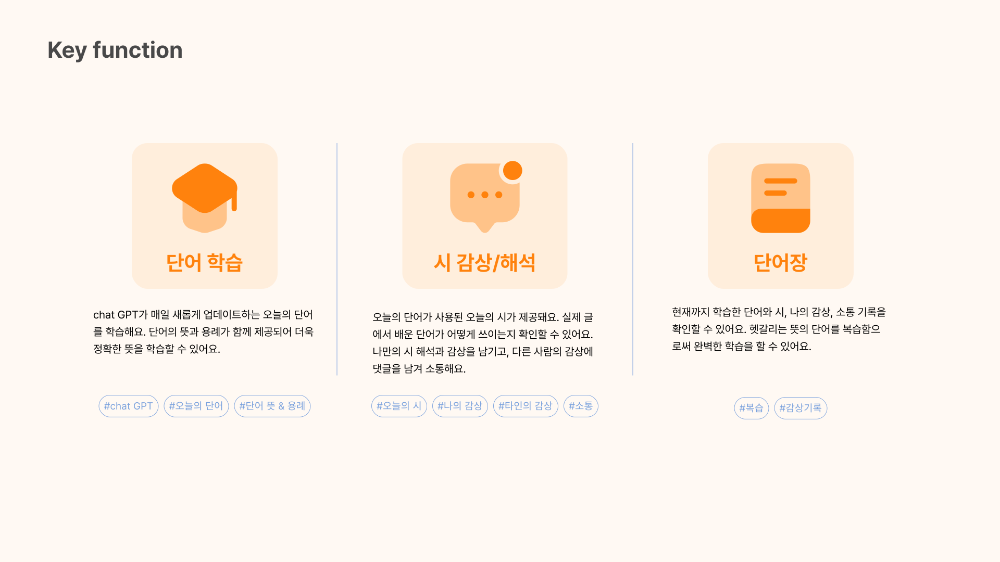

# 2024-Herethon-14

## 프로젝트 이름

오늘의 시

## 프로젝트 소개

**키워드 : MZ, 성장**
오늘의 시는 일상생활에서 쓰이지만 생소한 단어들을 학습할 수 있는 서비스 입니다 !

## key function



## 기술 스택

front : HTML , CSS , JS
back : Django , Python
design : Figma

## 개발자 소개

| 역할        | 이름   | 소속                              |
| ----------- | ------ | --------------------------------- |
| 기획·디자인 | 유하은 | 이화여자대학교 융합콘텐츠학과     |
| 프론트엔드  | 김하희 | 동덕여자대학교 데이터사이언스학과 |
| 프론트엔드  | 민서현 | 서울여자대학교 소프트웨어융합과   |
| 프론트엔드  | 조희주 | 성신여자대학교 성악과             |
| 백엔드      | 조수빈 | 성신여자대학교 컴퓨터공학과       |
| 백엔드      | 고희주 | 덕성여자대학교 소프트웨어전공     |

## 가상환경 실행 환경

```

  $ cd 2024-Herethon-14
  $ python -m venv myvenv
  $ source myvenv/Scripts/activate
  $ pip install -r requirements.txt
  $ python manage.py makemigrations
  $ python manage.py migrate
  $ python manage.py runserver

```
